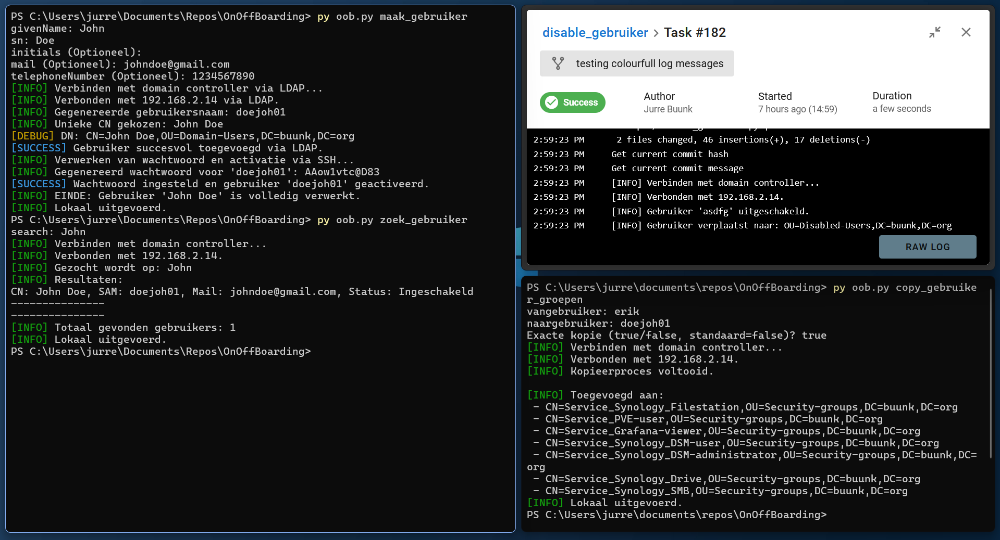

# OnOffBoarding

Automate Active Directory user management tasks with local scripts or via Semaphore API integration.



## Features

- Create AD users  
- Search users in AD  
- Add users to groups  
- Copy user group memberships  
- Disable AD users  
- Runs tasks locally or remotely via Semaphore API  
- Configurable LDAP and API settings via JSON files

## Usage

```bash
python oob.py <command> [-a [config.json]]
```

### Commands

* `create_user` — Create a new AD user
* `zoek_gebruiker` — Search for an AD user
* `voeg_gebruiker_aan_groep` — Add a user to a group
* `copy_gebruiker_groepen` — Copy groups from one user to another
* `disable_gebruiker` — Disable a user

### API mode

Use `-a` or `--api` to run commands via Semaphore API:

```bash
python oob.py create_user -a api.json
```

If no config file is provided, defaults to `api.json`.

## Configuration


> ⚠️ **Let op**
>
> Deze tool verwacht dat de volgende Organizational Units (OU's) bestaan in je Active Directory-structuur:
> - `Domain-Users`
> - `Security-groups`
> - `Disabled-Users`
>
> Deze OU-namen zijn op dit moment **hardcoded** in de scripts. Zorg ervoor dat deze exact zo bestaan in je AD-omgeving, anders zullen bepaalde functies niet correct werken.


### API config (`api.json`)

```json
{
  "url": "https://semaphore.example.org",
  "key": "your_api_bearer_token_here"
}
```

### LDAP config (`oobconf.json`)

```json
{
  "LDAP_HOST": "ldap.example.org",
  "LDAP_USER": "EXAMPLE\\adminuser",
  "LDAP_PASS": "your_ldap_password"
}
```

## Requirements

* Python 3.x
* Modules: `requests`, `colorama`, `unidecode`

Install dependencies:

```bash
pip install requests colorama unidecode
```
